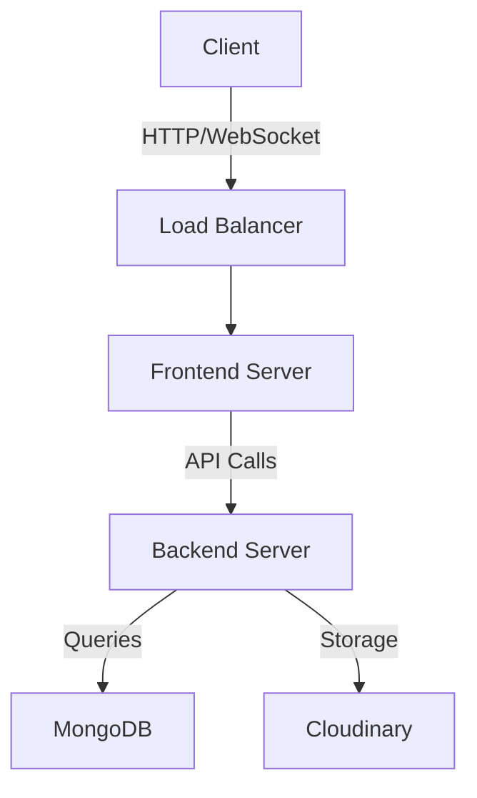

# Frame It - My Frame Your Art Our Platform


## 🎨 About The Project

Frame It is an innovative online platform that bridges the gap between local artists and art enthusiasts worldwide. Our mission is to empower artists by providing them with a digital showcase for their creative works while giving art lovers easy access to unique, local artistic treasures.

### Vision
To create a thriving digital ecosystem where local artists can flourish and art enthusiasts can discover unique pieces that speak to their souls.

### Why Frame It?
- **Support Local Artists**: Direct platform for artists to reach a wider audience
- **Secure Transactions**: Safe and transparent buying process
- **Community Driven**: Interactive features to engage with artists
- **Digital Innovation**: Cutting-edge 3D visualization technology
- **Global Reach**: Local art accessible to worldwide audiences

## 👥 Team Finest Members
- **Smith Maharjan** - Frontend Developer & UI/UX Designer
- **Hridaya Manandhar** - Full Stack Developer
- **Sahil Shrestha** - Backend Developer & Database Administrator

## 🚀 Getting Started

### Prerequisites
- Node.js (v14.0.0 or higher)
- npm (v6.0.0 or higher)
- Git
- Modern web browser
- Internet connection for Cloudinary services

### Installation Steps

1. Clone the repository:
```bash
git clone https://github.com/sahilstha0007/Finest.git
```

2. Install backend dependencies:
```bash
cd mainhackathontesting/backend
npm install
```

3. Install frontend dependencies:
```bash
cd ../frontend
npm install
```

4. Start the backend server:
```bash
cd ../backend
npm run dev
```

5. In a new terminal, start the frontend:
```bash
cd mainhackathontesting/frontend
npm run dev
```

The application will be running at http://localhost:5173

## 🎯 Features

### 🔐 User Authentication
- **Secure Registration**: 
  - Email verification
  - Password encryption using Bcryptjs
  - Role selection (Artist/User)
  - Profile customization
- **Login System**:
  - JWT token-based authentication
  - Remember me functionality
  - Password recovery option

### 🏠 Home Page
- Interactive 3D art model showcase
- Featured artists section
- Latest artwork carousel
- Art categories navigation
- Search functionality

### 🖼️ Art Gallery
#### For Users
- Browse artwork with advanced filters
- Like and save favorite pieces
- Comment on artworks
- Share on social media
- Purchase artwork
- Follow artists

#### For Artists
- Upload artwork with detailed descriptions
- Set pricing and availability
- Manage artwork listings
- Track engagement metrics
- Respond to comments
- Process orders

### 💳 Purchase System
- Secure checkout process
- Multiple payment options
- Order tracking
- Digital receipts
- Shipping integration

### 👥 User Profiles
- Customizable profile pages
- Portfolio display for artists
- Activity history
- Saved artworks collection
- Following/Followers system

### 📱 Responsive Design
- Mobile-first approach
- Tablet optimization
- Desktop enhancement
- Cross-browser compatibility

## 💻 Technical Implementation

### Frontend Architecture
```
frontend/
├── src/
│   ├── components/
│   ├── pages/
│   ├── context/
│   ├── hooks/
│   ├── services/
│   ├── utils/
│   ├── assets/
│   └── styles/
```

### Backend Architecture
```
backend/
├── src/
│   ├── controllers/
│   ├── models/
│   ├── routes/
│   ├── middleware/
│   ├── utils/
│   └── config/
```

### Database Schema
```
Collections:
- Users
- Artworks
- Comments
- Orders
- Likes
- Follows
```

## 🛠️ Technical Stack

### Frontend Technologies
- **React.js**: UI development
- **Tailwind CSS**: Styling
- **Framer Motion**: Animations
- **Three.js**: 3D rendering
- **GSAP**: Advanced animations
- **React-Three-Fiber**: 3D integration
- **Axios**: API communication
- **Redux**: State management

### Backend Technologies
- **Express.js**: Server framework
- **MongoDB**: Database
- **Mongoose**: ODM
- **JWT**: Authentication
- **Bcryptjs**: Password hashing
- **Cloudinary**: Image storage
- **Socket.io**: Real-time features

## 📊 System Architecture


## 🔄 Development Workflow
1. Feature branch creation
2. Local development
3. Testing
4. Code review
5. Staging deployment
6. Production deployment

## 🧪 Testing
- Unit tests using Jest
- Integration tests
- E2E tests using Cypress
- Performance testing
- Security testing

## 📈 Performance Optimization
- Lazy loading
- Code splitting
- Image optimization
- Caching strategies
- CDN integration

## 🔒 Security Measures
- HTTPS enforcement
- XSS protection
- CSRF prevention
- Rate limiting
- Input validation
- Secure headers

## 🌟 Future Enhancements
- Virtual reality art gallery
- NFT integration
- Artist verification system
- Art auction feature
- Mobile application
- AI-powered art recommendations

## 📝 Contributing
1. Fork the repository
2. Create your feature branch
3. Commit your changes
4. Push to the branch
5. Open a pull request

## 📜 License
This project is licensed under the MIT License - see the [LICENSE.md](LICENSE.md) file for details.

## 🙏 Acknowledgments
- Three.js community
- MongoDB team
- React development team
- Our mentors and advisors
- All contributing artists

## 📞 Contact & Support
- Website: [Frame It](#)
- Email: support@frameit.com
- Twitter: [@FrameItArt](#)
- Instagram: [@frameit.gallery](#)

## 🔍 Project Status
Current Version: 1.0.0
Status: Active Development

---
Created with ❤️ by Team Finest
