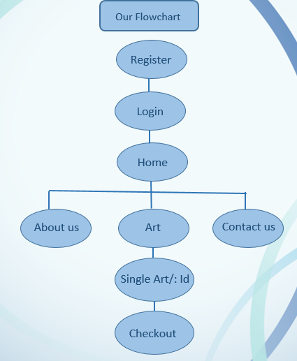

# Frame It - My Frame Your Art Our Platform


## Introduction 
Our team finest participated in this hackethon organized by tech titans for a purpose which is to solve the problems related to local artist marketplace
1. Limited Visibility
Challenge: Many local artists struggle to reach a global or even national audience due to limited marketing resources, platforms, or knowledge of digital marketing strategies.
Impact: Without exposure, their work often remains unknown, limiting their potential sales and growth.

2. Cultural and Societal Barriers
Challenge: Local artists may face societal biases, especially in regions where certain art forms are undervalued, or art is not seen as a viable career.
Impact: This can result in a lack of recognition and support from both the public and government.

3. Pricing Challenges
Challenge: Determining the right price for their art can be difficult, especially when competing with other artists or platforms that dictate pricing structures.
Impact: Artists may underprice their work out of a lack of confidence or overshoot with prices that aren't market-competitive, leading to lost sales.

4. Lack of Networking and Community Support
Challenge: Many local artists work in isolation without sufficient networks or community support.
Impact: This can limit opportunities for collaboration, exposure, and growth. Artists may miss out on valuable partnerships or learning opportunities.

5. Cluttered User Interface
Problem: Overcrowded screens with too many elements, buttons, or text can overwhelm users and make it difficult to navigate the interface.
Impact: Users may get frustrated, struggle to find what they're looking for, and ultimately abandon the platform or app.

##Problem-Solving
After brainstorming  we came up with these solutions like

1. User-Friendly Artist Profiles:
Create customizable artist profiles that allow them to showcase their art, live comment and like counts and personal story behind the artwork. The profiles should include a professional-looking photo and an "about me" section.

2. Artwork Listing with Detailed Information:
Enable artists to upload high-resolution images of their artwork, along with detailed descriptions. Each listing should feature essential information like pricing, availability details.

3. E-commerce Integration for Seamless Transactions:
Integrate a secure and user-friendly e-commerce system, allowing buyers to purchase artwork directly through the platform. Provide multiple payment options (credit cards, PayPal, etc.), and include an easy-to-use shopping cart and checkout process.

4. User Roles (Artist and Buyer):
Implement a role-based authorization system where users can register as either an artist or a buyer. Artists would have access to tools for uploading and managing their artwork, while buyers would have access to browse, purchase, and interact with art listings. This helps differentiate user experiences based on roles.

## Implementation 
1. Set Up User Roles (Artist and Buyer)
Since Frame It is an online marketplace for artists and buyers, you'll need to define two primary user roles:

Artist: Can upload, delete, and manage artwork.
Buyer: Can browse, purchase, and interact with artworks.
Steps:
During the user registration process, add a field that allows users to choose their role (Artist or User). You can also set default values (e.g., User) and let admins assign roles for users.
Store the role in the user database (MongoDB, for example). When a user logs in, retrieve their role and manage access based on it.

2. JWT Authentication for Secure Login
To implement secure login and session management, use JWT (JSON Web Tokens) for authentication.

Steps:
On login, authenticate the user by verifying their credentials (email and password).
Once verified, generate a JWT token and send it to the frontend.
The frontend stores the JWT in localStorage or cookies to maintain user session.
For each subsequent request, the frontend includes the JWT in the Authorization header (Bearer token), and the backend verifies the token.

3. User-Centered Design (UCD) Principles
Simple Navigation: Ensure that users (artists and users) can easily navigate between sections (home, art gallery, contact, checkout, etc.) without feeling overwhelmed.
Mobile-First: Design with a mobile-first approach, as many users may access the platform from their phones. Then, optimize for tablets and desktops.
Accessibility: Make sure that the website is accessible to all users. This includes keyboard navigation, screen reader support, and color contrast.

4. Design Layout
Home Page (Landing Page)
  Hero Section:
  A clean, visually stunning hero section that highlights featured artwork. Use a large, high-quality image or an interactive 3D model (via Three.js or React-Three-Fiber) that represents the spirit of the     
   platform.

About Section Layout
  Large Background Image/Video: Use a high-quality image or video showing artists creating or displaying artwork. Alternatively, use an animated 3D model or gallery showcase.
  Text Overlay: Include the platform's tagline or mission statement over the image/video.

 Art Page Structure
The Art page should have the following sections:

  Title: Display the page title or an introductory heading like "Post Your Artwork."
  Upload Form: Provide fields for uploading the art.
  Image Upload: An image field where users can upload artwork images.
  Details Form: Additional form fields to fill out such as title, description, category, price, etc.
  Submit Button: Button to submit the artwork for posting.

SingleArt Page Structure
  The SingleArt Page should include:
  
  Artwork Display: Display the artwork with details like title, description, artist, and price.
  Like Button: A button to like the artwork.
  Comment Section: A section where users can leave comments.
  Form to Add Comment: A simple form with a text area for users to write their comment.
  Comment List: Display a list of previous comments for the artwork.

5. Checkout Page
The checkout process should be as simple and intuitive as possible. It should include:

Order Summary: List the selected artworks, quantity, total price, and shipping info.
Payment Integration: Use a popular payment gateway like Stripe or PayPal for secure payments.
Form Validation: Ensure all necessary information (shipping address, contact info) is filled out properly before submitting.

## Process of creation
1. Ideation and Planning
Research: we understood the needs of both artists and art users. we researched about the existing marketplaces, identify problems, and found opportunities to offer something unique.
User Personas: Define the target audience (artists, buyers, art enthusiasts, etc.) and their needs.
Project Goals: Establish clear goals, such as providing a platform for local artists to showcase their work, secure transactions, and facilitate art sales.
Features List: Outline the essential features, such as artist profiles, artwork listings, shopping cart, secure payment system, comment/like system, etc.
Wireframes & Mockups: Design basic wireframes for the site, including the home page, artist profile, artwork listing page, and purchase flow.\

2. Frontend Development
Framework Selection: Use React.js for building the user interface, ensuring it is dynamic and responsive. Combine it with Tailwind CSS for styling.
Components Development:
Homepage: Design the homepage to showcase featured artworks, latest art, artist profiles, etc.
Artist Profile Page: Allow artists to upload and manage their artwork.
SingleArt Page: A detailed page showing individual artwork, including a like and comment system.
Checkout & Cart: Implement a shopping cart for users to buy artwork securely.
3D Features: Integrate Three.js or React-Three-Fiber to display 3D artwork for a more interactive user experience.
Routing: Implement the routing system using React Router to navigate between different pages (e.g., homepage, art gallery, login, checkout).

3. Backend Development
Server Framework: Use Express.js to create the backend REST API, handling data operations between the frontend and the database.
Database Setup: Set up MongoDB for storing user data, artwork details, comments, likes, and purchase orders. Create models for users, artworks, comments, and orders.
Authentication: Implement JWT (JSON Web Token) for secure user authentication, including features like login, registration, and password hashing with bcryptjs.
Artwork Management: Allow artists to upload, manage, and list artworks with detailed descriptions, prices, and availability.
Comment/Like System: Implement backend routes for adding comments and likes to artwork. Ensure that users can interact with artworks directly.

4. Integration
Frontend-Backend Communication: Use Axios for sending API requests from the frontend to the backend, such as fetching artwork, submitting comments, and handling user authentication.
Cloud Storage for Images: Use Cloudinary or similar services to handle artwork image storage and management.

5. Testing
Unit Testing: Write unit tests for individual components and functions using testing libraries like Jest and React Testing Library.
Integration Testing: Test the integration between the frontend and backend to ensure smooth communication, such as verifying the comment posting functionality or the checkout process.
End-to-End (E2E) Testing: Use Cypress to perform automated end-to-end tests, ensuring the user journey from registration to checkout works seamlessly.
Security Testing: Conduct security tests to protect against common vulnerabilities like XSS, CSRF, and SQL injection.


## 🎨 About The Project

Frame It is an innovative online platform that bridges the gap between local artists and art enthusiasts worldwide. Our mission is to empower artists by providing them with a digital showcase for their creative works while giving art lovers easy access to unique, local artistic treasures.

### Vision
To create a thriving digital ecosystem where local artists can flourish and art enthusiasts can discover unique pieces that speak to their souls.

### Why Frame It?
- **Support Local Artists**: Direct platform for artists to reach a wider audience
- **Secure Transactions**: Safe and transparent buying process
- **Community Driven**: Interactive features to engage with artists
- **Digital Innovation**: Cutting-edge 3D visualization technology
- **Global Reach**: Local art accessible to worldwide audiences

## 👥 Team Finest Members
- **Smith Maharjan** - Full Stack Developer
- **Hridaya Manandhar** - Idea Innovator 
- **Sahil Shrestha** - Frontend Developer & UI/UX Designer

## 🚀 Getting Started

### Prerequisites
- Node.js (v14.0.0 or higher)
- npm (v6.0.0 or higher)
- Git
- Modern web browser
- Internet connection for Cloudinary services

### Installation Steps

1. Clone the repository:
```bash
git clone https://github.com/sahilstha0007/hackathon.git
```

2. Install backend dependencies:
```bash
cd hackathon/backend
npm install
```

3. Install frontend dependencies:
```bash
cd ../frontend
npm install
```

4. Start the backend server:
```bash
cd ../backend
npm run dev
```

5. In a new terminal, start the frontend:
```bash
cd hackathon/frontend
npm run dev
```

The application will be running at http://localhost:5173

## 🎯 Features

### 🔐 User Authentication
- **Secure Registration**: 
  - Email verification
  - Password encryption using Bcryptjs
  - Role selection (Artist/User)
  - Profile customization
- **Login System**:
  - JWT token-based authentication
  - Remember me functionality
  - Password recovery option

### 🏠 Home Page
- Interactive 3D art model showcase
- Featured artists section
- Latest artwork carousel
- Art navigation

### 🖼️ Art Gallery
#### For Users
- Browse artwork with advanced filters
- Like and save favorite pieces
- Comment on artworks
- Share on social media
- Purchase artwork

#### For Artists
- Upload artwork with detailed descriptions
- Set pricing and availability
- Manage artwork listings
- Track likes and comment
- Respond to comments
- Process orders

### 💳 Purchase System
- Secure checkout process
- Multiple payment options
- Order tracking
- Digital receipts
- Shipping integration

### 👥 User Profiles
- Customizable profile pages
- Portfolio display for artists
- Activity history
- Saved artworks collection

### 📱 Responsive Design
- Mobile-first approach
- Tablet optimization
- Desktop enhancement
- Cross-browser compatibility

## 💻 Technical Implementation

### Frontend Architecture
```
frontend/
├── src/
│   ├── assets/
│   ├── components/
│   ├── config/
│   ├── context/
│   ├── datas/
│   ├── hooks/  
│   ├── pages/ 
│   └── styles/
```

### Backend Architecture
```
backend/
├── src/
│   ├── cloudinary/
│   ├── config/
│   ├── controller/
│   ├── data/
│   ├── model/
│   ├── multer/
│   └── route/
│   └── seeding/
│   └── service/
```

### Database Schema
```
Collections:
- Users
- Artworks
- Comments
- Orders
- Likes
- Follows
```

## 🛠️ Technical Stack

### Frontend Technologies
- **React.js**: UI development
- **Tailwind CSS**: Styling
- **Framer Motion**: Animations
- **Three.js**: 3D rendering
- **GSAP**: Advanced animations
- **React-Three-Fiber**: 3D integration
- **Axios**: API communication

### Backend Technologies
- **Express.js**: Server framework
- **MongoDB**: Database
- **Mongoose**: ODM
- **JWT**: Authentication
- **Bcryptjs**: Password hashing
- **Cloudinary**: Image storage




## 🔄 Development Workflow
1. Feature branch creation
2. Local development
3. Testing
4. Code review
5. Staging deployment
6. Production deployment

## 🧪 Testing
- Unit tests using Jest
- Integration tests
- E2E tests using Cypress
- Performance testing
- Security testing

## 📈 Performance Optimization
- Lazy loading
- Code splitting
- Image optimization
- Caching strategies
- CDN integration

## 🔒 Security Measures
- HTTPS enforcement
- XSS protection
- CSRF prevention
- Rate limiting
- Input validation
- Secure headers

## 🌟 Future Enhancements
Future Goals for Frame It Website
As Frame It continues to evolve and grow, here are some key future goals that will help the platform enhance its functionality, reach, and user experience:

1. Working Payment System Integration
Goal: Implement a fully functional and secure payment system for seamless transactions between artists and buyers.
Details: Integrate reliable payment gateways such as Stripe, PayPal, and even cryptocurrency options (Bitcoin, Ethereum) to cater to a broader audience. The payment system should support secure, transparent transactions, ensuring buyers and artists feel confident in their purchases and sales.
Benefit: This will enable users to securely purchase artwork and artists to receive payments with ease. It’s a fundamental feature for creating a trustworthy marketplace.

2. Online Hosting & Scalability
Goal: Host the platform on a reliable, scalable infrastructure to handle increasing traffic and data storage needs.
Details: Utilize cloud hosting providers like AWS, Google Cloud, or Microsoft Azure to ensure fast, reliable, and secure hosting. This will allow Frame It to scale as the number of users and artists grows, ensuring smooth performance even during traffic spikes. Implement auto-scaling to meet demand dynamically.
Benefit: Reliable hosting guarantees uptime, fast load times, and a positive user experience. Scalability ensures the platform can accommodate future growth without performance degradation.

3. AI-Powered Art Recommendations
Goal: Implement an AI-driven recommendation engine to personalize the user experience.
Details: Use machine learning algorithms to analyze user behavior and preferences, providing personalized art recommendations based on their previous interactions, likes, and browsing history. This can also extend to suggesting new artists or art categories to explore.
Benefit: Personalized recommendations will drive more engagement, keep users coming back, and ultimately increase sales.

4. Search Engine Optimization (SEO)
Goal: Improve the platform’s visibility on search engines to drive organic traffic and increase user engagement.
Details: Implement on-page and off-page SEO best practices, including optimizing title tags, meta descriptions, URLs, and content with relevant keywords. Create a sitemap, use structured data (schema markup) for artworks and artist profiles, and build backlinks to improve domain authority.
Benefit: Strong SEO will improve Frame It's search engine rankings, driving more organic traffic to the website and increasing the platform's visibility to potential users and buyers.

5. Mobile Application Development
Goal: Develop a mobile application for iOS and Android to reach a wider audience and provide a more accessible, user-friendly experience.
Details: Build native mobile applications for both iOS and Android platforms, ensuring that users can browse, purchase, and interact with artwork seamlessly on their smartphones. Mobile apps will provide push notifications for new artworks, artist updates, and purchase alerts.
Benefit: A mobile app improves accessibility and enhances user engagement, allowing buyers and artists to stay connected to the platform anytime, anywhere.

6. Enhanced User Experience (UX/UI) Design
Goal: Continuously improve the platform’s user interface (UI) and user experience (UX) for a more intuitive and engaging experience.
Details: Regularly conduct user testing to identify pain points and optimize the design accordingly. Focus on simplifying navigation, reducing clutter, and improving artwork display. Consider implementing interactive features like virtual galleries, 360-degree views of art, and augmented reality previews for users.
Benefit: A seamless, engaging user experience will lead to higher user satisfaction, increased time spent on the platform, and more conversions.

7. Artist Collaboration & Community Features
Goal: Foster a stronger sense of community and collaboration among artists on the platform.
Details: Implement features that allow artists to collaborate on projects, share artwork, and co-create digital pieces. Develop community-driven events like virtual art shows or online art contests where artists can participate and showcase their skills.
Benefit: Strengthening the artist community will create a more dynamic and supportive environment, encouraging artists to engage with the platform regularly and increase their visibility.

8. International Expansion
Goal: Expand Frame It to cater to international artists and buyers by supporting multiple languages, currencies, and shipping options.
Details: Add multi-language support for artists and users from different regions. Enable currency conversion based on location, allowing international transactions. Provide shipping integrations for global deliveries.
Benefit: International expansion will increase the platform’s global reach, allowing artists to gain worldwide exposure and buyers to access unique art from different cultures.


## 📝 Contributing
1. Fork the repository
2. Create your feature branch
3. Commit your changes
4. Push to the branch
5. Open a pull request

## 📜 License
This project is licensed under the MIT License - see the [LICENSE.md](LICENSE.md) file for details.

## 🙏 Acknowledgments
- Three.js community
- MongoDB team
- React development team
- Our mentors and advisors
- All contributing artists

## 📞 Contact & Support
- Website: [Frame It](#)
- Email: support@frameit.com
- Twitter: [@FrameItArt](#)
- Instagram: [@frameit.gallery](#)

## 🔍 Project Status
Current Version: 1.0.0
Status: Active Development

---
Created with ❤️ by Team Finest
